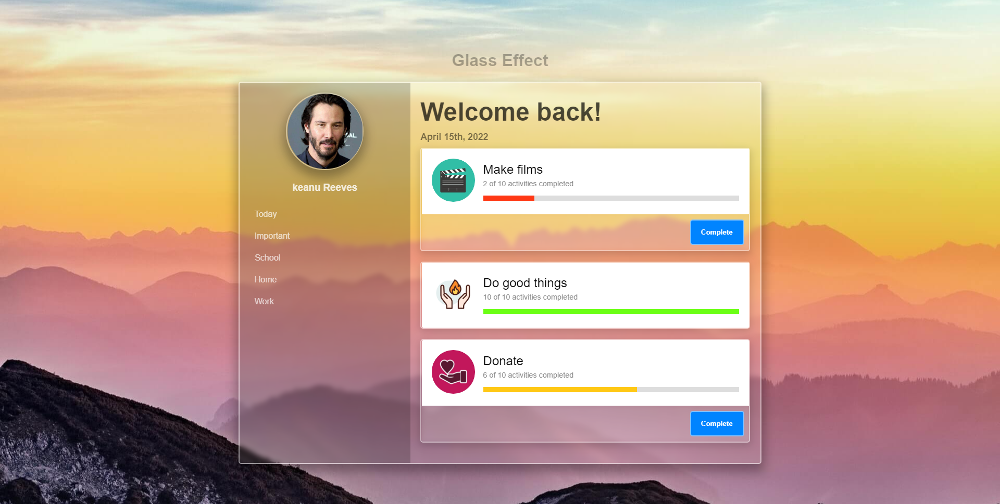

### it's about

a practice of css effect, where I make an interface with glass effect

### Screenshot

### link to page

- URL de la app: [link](https://sergio-ivan-melgarejo.github.io/Only-CSS-Glass-Effect/)